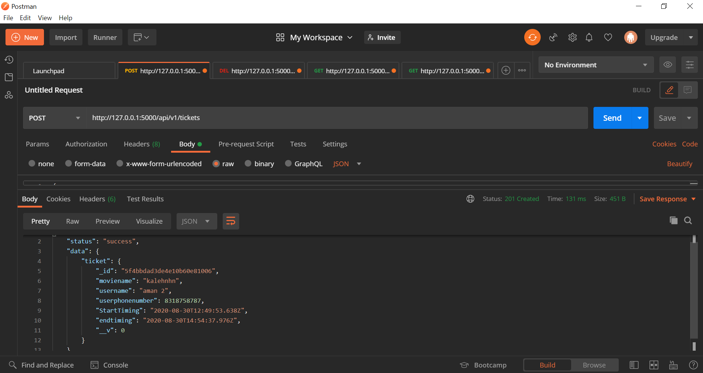

# movie_ticket

## Introduction
in this project a backend part of booking ticket of movie has been implemented using Nodejs and MongoDB

## Prerequisite..
- node.js
- javascript
 
## Database
  - MongoDB
 
 ## Basic SetUp
1. install node package manager(npm)
2. install node module
3. install Mongoose
4. connect to mongoDB compass
5. Run the project: nodemon server.js

## Output

#### An endpoint to view all the tickets for a particular time.

#### An endpoint to book a ticket using a user’s name, phone number, and timings.

#### An endpoint to update a ticket timing.

#### An endpoint to delete a particular ticket.

#### An endpoint to view the user’s details based on the phone number.

